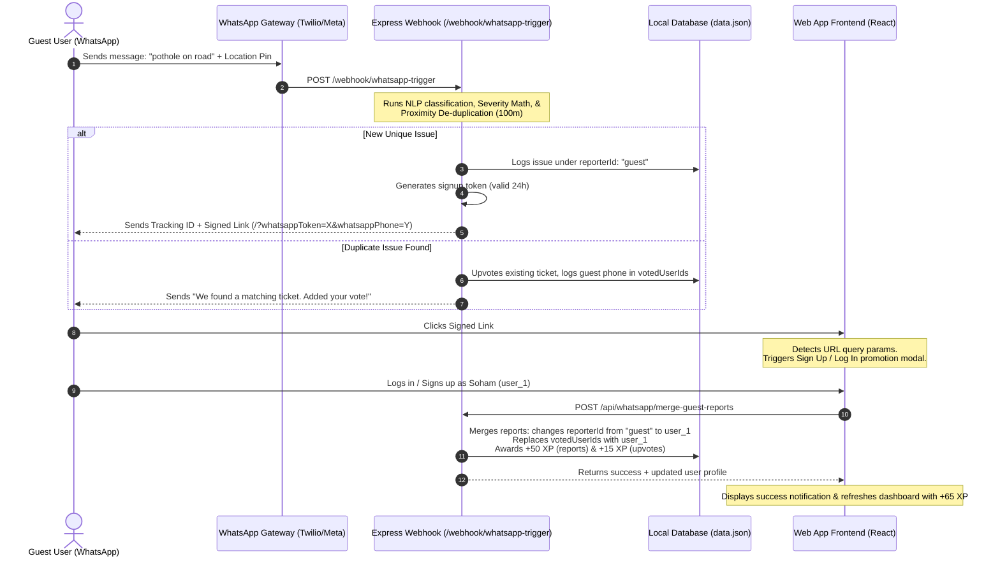
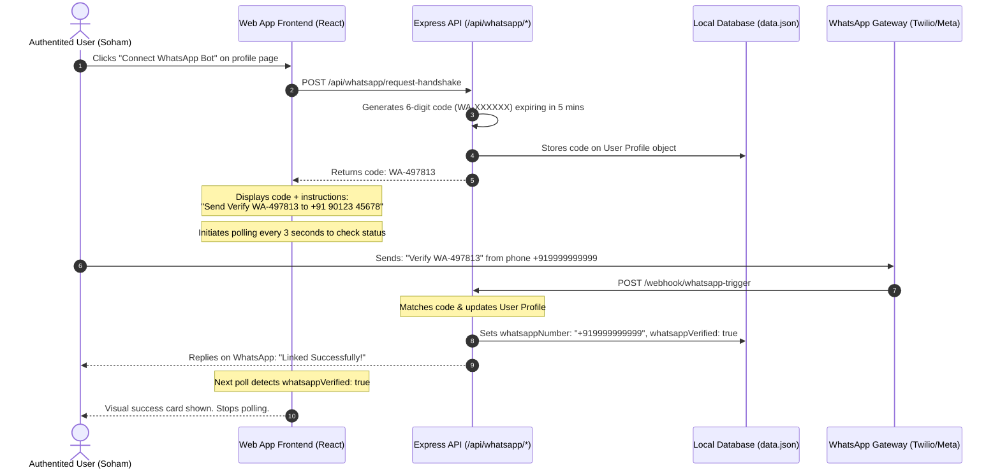

Viewed ProfileView.tsx:71-110

Here is the end-to-end architectural flow of the WhatsApp integration, explaining both user interactions on the UI and the underlying backend APIs that connect to external WhatsApp Business providers (e.g., Twilio, Gupshup, or Meta Cloud API).

---

### Flow A: Guest / First-Time Reporting & Auto-Merging
This flow handles users who interact with the system via WhatsApp first, without having an account on the web application.



---

### Flow B: Profile-to-WhatsApp Handshake Connection
This flow handles active web application users linking their pre-existing profiles to their WhatsApp numbers.



---

### API Endpoint Specifications (For Service Providers)

#### 1. Webhook Ingestion Hook
* **Endpoint:** `POST /webhook/whatsapp-trigger`
* **Purpose:** This is the URL configured as the webhook callback in the Twilio/Meta dashboard. It handles incoming text, media, and location payloads.
* **Request Payload Structure:**
  ```json
  {
    "from": "+919999999999",
    "body": "pothole on 100ft road",
    "latitude": 12.9719,
    "longitude": 77.6412,
    "imageUrl": "https://media.url/path.jpg"
  }
  ```
* **Internal De-duplication Logic:**
  * Checks existing database tickets.
  * Calculates distance between coordinate points. If **$\le 100$ meters**, checks if the category matches.
  * If category matches, runs a Jaccard word-similarity comparison on the descriptions.
  * If **$> 50\%$ similar**, rejects duplicate report creation and increments the existing ticket's upvotes count (tagging the voter as `"wa_" + phone`).

#### 2. Request Handshake Code
* **Endpoint:** `POST /api/whatsapp/request-handshake`
* **Purpose:** Generates a short-lived verification code for active users.
* **Payload:** `{"userId": "user_id_here"}`
* **Response:** `{"success": true, "code": "WA-497813"}`

#### 3. Verify Token Validity
* **Endpoint:** `GET /api/whatsapp/verify-token`
* **Purpose:** The web client calls this on page load when detecting `whatsappToken` in the query parameters to verify if the redirect is valid.
* **Parameters:** `?token=tok_xxxx&phone=+91xxxx`
* **Response:** `{"valid": true}`

#### 4. Guest Reports Merge
* **Endpoint:** `POST /api/whatsapp/merge-guest-reports`
* **Purpose:** Called by the client React app immediately after the guest logs in. Links their guest activities to their real account profile.
* **Payload:**
  ```json
  {
    "token": "tok_xxxx",
    "phone": "+919999999999",
    "userId": "9CPEpFcK1fWcRxlwaQoYD323y5u1"
  }
  ```
* **Response:**
  ```json
  {
    "success": true,
    "mergedIssuesCount": 1,
    "pointsAwarded": 65,
    "profile": { ... }
  }
  ```